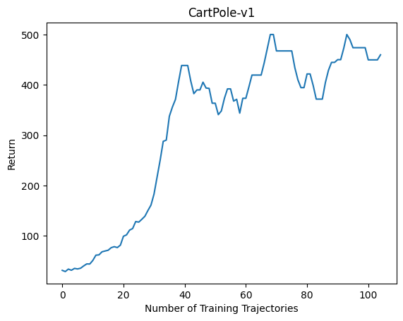

# ggrl

## UDRL
Learn to [upside-down reinforcement learn](https://arxiv.org/abs/1912.02875) using a [Neural Process](https://arxiv.org/abs/1807.01622).
Key idea: instead of conditioning the action predictor on the return, condition on a set of examples (state, action, return) with lower returns.

## PVN
[Policy evaluation networks](https://arxiv.org/abs/2002.11833) with a few improvements:
 - Instead of learning probing states, use sampled states
 - Instead of concatenating a fixed number of state-action embeddings together to form a fingerprint, mean-pool an arbitrary number of embeddings
 - To prevent the PVN from learning to predict return from the state distribution alone while ignoring actions, shuffle actions in each batch and set the return prediction target to the minimum return for the environment
 - Improve the fingerprint representation by using it to reconstruct actions, in addition to predicting returns
 - Regularize policy optimization by minimizing reconstruction error, in addition to maximizing predicted return